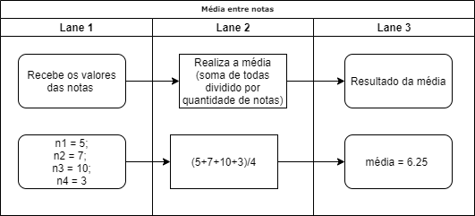
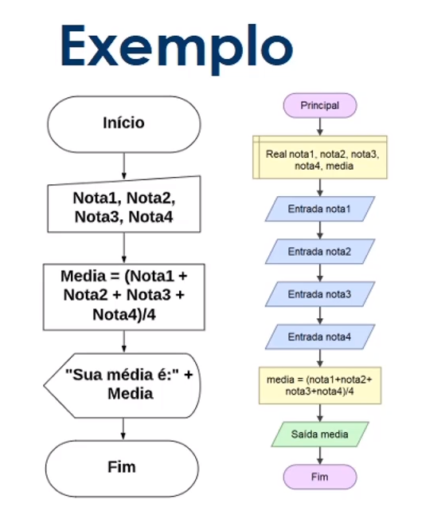
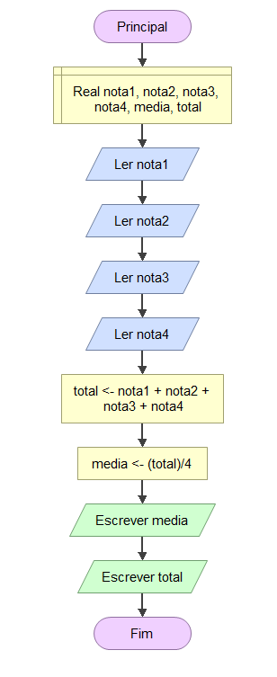
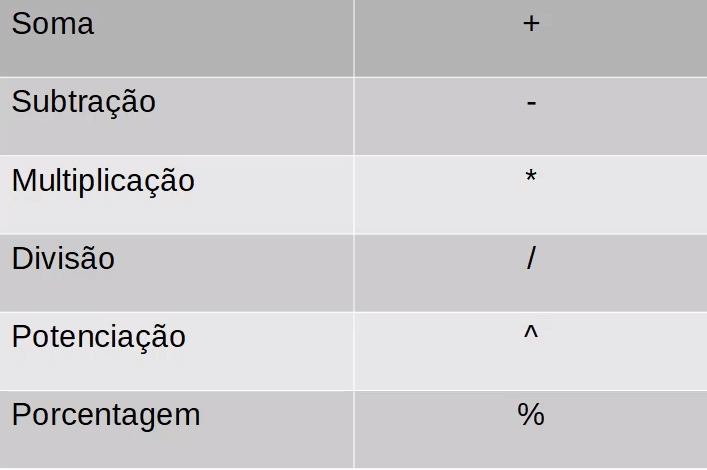
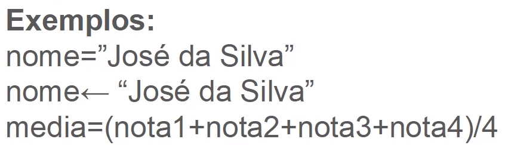
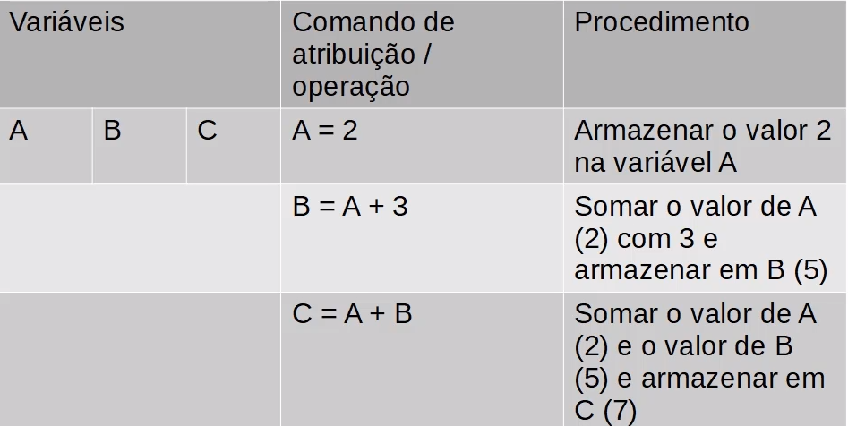
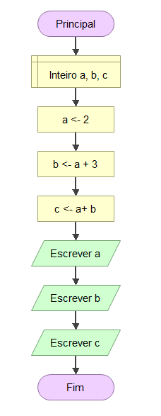
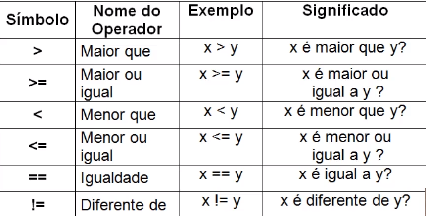
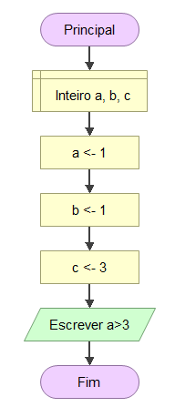

# Introdução à lógica e à programação
>> VISUALIZAR NO VISUL STUDIO CODE O ARQUIVO README.md `ctral + alt + v`.
## **Entendendo o que é lógica**

Porgramar é criar lógica e solução de problemas.

* Lógica - coerência de raciocínio de ideias.
  
* Lógica de programação - melhor alternativas de ações para chegar em uma solução. 
  
* Metacognição -  A metacognição é a capacidade do ser humano de monitorar e auto-regular os processos cognitivos (Flavell, 1987; Nelson & Narens, 1996; Sternberg, 2000). A essência do processo metacognitivo parece estar no próprio conceito de self, ou seja, na capacidade do ser humano de ter consciência de seus atos e pensamentos.
  


* Abrstação - habilidade de concentrar nos aspectos essenciasis de um contexto qualquer, ignorando características menos importantes ou acidentais. 

**Exercício final**

Crie um mapra mental para resolver um derermindo problema, por exemplo, calcular a média aritméticas de 4 notas, sabendo que asd notas são as seguintes: 

    * Nota 1: 5
    * Nota 2: 7
    * Nota 3: 10 
    * Nota 4: 3

>> Utilizando o 'draw.io diagrams',tem a ferrmanta de forma online e de forma offline no microfoft store.


**SOLUÇÃO ATIVIDADE UM:MAPA MENTAL**: 



## **O que são fluxogramas e pesudocódigo**

* O que são algoritmo

Em matemática e ciência da computação, um algoritmo é uma sequência finita de ações executáveis que visam obter uma solução para um determinado tipo de problema.
>> Origem: Wikipédia, a enciclopédia livre.


>> Uma animação do algoritmo de ordenação quicksort de uma matriz de valores ao acaso. As barras vermelhas marcam o elemento pivô. No início da animação, estando o elemento para o lado direito, é escolhido como o pivô

* O que são pseudocódigo

Pseudocódigo é uma forma genérica de escrever um algoritmo, utilizando uma linguagem simples (nativa a quem o escreve, de forma a ser entendida por qualquer pessoa) sem necessidade de conhecer a sintaxe de nenhuma linguagem de programação. Um exemplo de pseudocódigo é o Portugol, que utiliza o compilador Visualg ou Portugol Viana que pode ser baixado do portal de software livre SourceForge.
>> Origem: Wikipédia, a enciclopédia livre.

Exemplo:

Abaixo vemos o exemplo de um programa que faz a leitura de dez números e calcula a média dos números positivos:

```
INÍCIO
VARIÁVEIS
S,C,I,A,MD:Real;

S ← 0;
C ← 0;
PARA I de 1 ATÉ 10 FAÇA PASSO 1
    Escreva "Digite um número: ";
    LEIA A;
    SE A ≥ 0 ENTÃO
         S ← S + A;
         C ← C + 1;
    FIM SE;
FIM PARA;

MD ← S / C;
ESCREVER ("A média é: ", MD);

FIM
```
**Exercício final**

1 - Crie um algoritmo do seu dia

**Solução**
Algoritmo fazer café

```
INICIO DO ALGORITMO

- Esquentar a água
- Coar o café.
- Pegar xícara ou copo.
- Adicionar café na xícara.

FIM DO ALGORITMO
```

2 - Abra o site https://studio.code.org/s/mc/stage/1/puzzle/1 e tente resolver todos os problemas em menos de uma hora.

## **Aprendendo fluxograma, variáveis e costantes.**
  
* Fluxograma

é um tipo de diagrama, e pode ser entendido como uma representação esquemática de um processo ou algoritmo, muitas vezes feito através de gráficos que ilustram de forma descomplicada a transição de informações entre os elementos que o compõem, ou seja, é a sequência operacional do desenvolvimento de um processo, o qual caracteriza: o trabalho que está sendo realizado, o tempo necessário para sua realização, a distância percorrida pelos documentos, quem está realizando o trabalho e como ele flui entre os participantes deste processo.
>> Origem: Wikipédia, a enciclopédia livre.


Exemplo de fluxograma do exercício da média:



* Variáveis

Variável (programação) - objeto situado na memória que representa um valor ou expressão
>> Origem: Wikipédia, a enciclopédia livre.

memória 


Tipos de variáveis:
 * Numéricas
 * Caracteres
 * Alfanuméricas
 * lógicas
  
>> Programa para criar fluxograma de forma fácil e rápida : baixar http://www.flowgorithm.org
>> Arquivos criados se encontram na bsata fluxograma

**Exercício final**

Exibir o total e média



## **Tomadas de decisões e expressões**
* Expressõesa artméticas

São expressões que utilizam operadors aritméticos e funções aritméticas envolvendo contantes e variáveis. 

Exemplo:

```
50 + 50
total + 50
```
* Operadores aritméticos



>> OBS: o simbolo de porcentagem normalmente é nomeado como mod, esse operador se diferencia da porcentagem que conhecemos. Ele retorna o valor de resto da divisão entre dois números.

* Expressões literais

São expressões com costantes e/ou variáveis que tem como resultado valores literais. 



>> Formas de atribuição em algumas linguagens



>> Exemplo de expressões literais em forma de teste de mesa explicado.



>> Resolução utilizando fluxograma. Pode se encontrado na pasta fluxograma.

* Operadores relacionais

São expressões composta por outras expressões ou variáveis numéricas com operadors relacionais. As expressões relacionais retornam valore lógicos(verdadeiro ou falso).



>> O operadores lógicos em sua maioria são utilizado para fazer a realização de desvio de fluxos de execusão do algorimo.

Exemplo utilizando o fluxograma par vermos na prática os operadores relacionais.



>> Ao rodar esse programa teremos a saída sendo falso.

* Tomadas de decisão

Tomadas de defições são a utilização na prática dos operadores lógicos para determinar o fluxo do algoritmo. 

Exemplo de um fluxograma.


>> temos nessa imagem um fluxograma com a tomada de decisão.

**Exercício final**

Declara quatro variáveis janeiro, fevereiro, março e abril.Valor de venda em cada mês, variáveil média para calcular os valores nos meses. Se maior ou igual à 5000 exibir a mensagem: "parabéns abono de 10%". Caso contrário receberá um abono de 3%.

**Solução**


## **Como utilizar a concatenação**

* Concatenação
 
Concatenação é um termo usado em computação para designar a operação de unir o conteúdo de duas strings. Por exemplo, considerando as strings "casa" e "mento" a concatenação da primeira com a segunda gera a string "casamento".
>> Origem: Wikipédia, a enciclopédia livre.

Definição:

Agrupamento de duas ou mais células que, incluindo fórmulas, textos ou outras informações contidas no seu interior, dá origem a um único resultado.


>> Exemplo de fluxograma que utiliza a concatenação no método de saída.


>> o símbolo ecomercial é utilizado para mercar uma concatenação. Essa concatenação é util para criar exibições para o usuário.

**Exercicío final**

Utilizar o exercício de média e fazer as seguintes modificações. Pegar o nome no aluno, pediar a notas, calcular a média, dizer:"Seu nome é: x e sua média foi : y".

**Solução**


# Introdução ao Portugol

## **Aprenda como  utilizar uma estrutura de repetição**

* Estrutura de repetição

Permite executar mais de uma vez o mesmo comando ou conjunto de comando, de acordo com uma condição ou com um contador.


**Exercicío**

Fazer a tabuada do número 9.

**Solução**


## **O que são linguagens de programação**

* Linguagem de programação

A linguagem de programação é um método padronizado, formado por um conjunto de regras sintáticas e semânticas, de implementação de um código fonte - que pode ser compilado e transformado em um programa de computador, ou usado como script interpretado - que informará instruções de processamento ao computador. Permite que um programador especifique precisamente quais os dados que o computador irá atuar, como estes dados serão armazenados ou transmitidos e, quais ações devem ser tomadas de acordo com as circunstâncias. Linguagens de programação podem ser usadas para expressar algoritmos com precisão.

`O que é obvio para você, certamente não é óbvio para uma máquina. E se você quer que a máquina faça algo para você, você precisa, 'falar com ela'`

A função das linguagem de programação é servir de um meio de comunicação entre computadores e humanos.

Temos as linguagem de alto e baixo nível.
 * Alto nível : essas são aquelas cuja sintaxe se aproxima mais da nossa linguagem e se distanciam mais da linguagem de máquina.
 * Baixo nível : é aquela que se aproxima mais da linguagem de máquina. Essas são as que você precisa ter o conhecimento direto da arquitetura do computador par fazer alguma coisa.

>> para programar em linguagem de baixao nível é necessário ter conhecimento em arquiteturas de computadores.

* Compiladas ou interpretadas

Compiladas: é uma linguagem de programação em que o código fonte, é executada diretamente pelo sistema operacional ou pelo processador, após ser traduzido por meio de um processo chamado compilação.


Interpretadas: é uma linguagem de programação em que o código fonte é executado por um programa de computador chamado interpretador, que em seguida é executado pelo sistema operacional ou processador.


* O que é o portugol?

Portugol, também conhecido como Português estruturado, é um pseudocódigo escrito em português.

>>Origem: Wikipédia, a enciclopédia livre.
Exemplo de código em portugol: 

```
algoritmo OlaMundo;

inicio
   escreva("Olá, Mundo!");
fim
```
Baixar IDE parta PORTUGAL: 

 * [link para baixar](https://github.com/UNIVALI-LITE/Portugol-Studio/releases)

 * URL: `https://github.com/UNIVALI-LITE/Portugol-Studio/releases`

Exemplo de código gerado: 

```
programa
{
	
	funcao inicio()
	{
		real nota1, nota2, nota3, nota4, media //declaração das variáveis
		//tipos caracter(uma string)
		//tipo cadeia conjunto de stringd
		cadeia aluno

		escreva("Digite o nome do aluno: ")
		leia(aluno)
		escreva("Nota 1: ")
		leia(nota1)
		escreva("Nota 2: ")
		leia(nota2)
		escreva("Nota 3: ")
		leia(nota3)
		escreva("Nota 4: ")
		leia(nota4)

		media = (nota1+nota2+nota3+nota4)/4
		escreva("O aluno: " + aluno + " obteve a média: " + media)
	}
}

```

**Exercício**

Obter a média de vendas do funcionário nos meses de: janeiro, fevereiro, março e abril. Exibir o total de vendas e a média.

**Solução**

```
programa
{
	
	funcao inicio()
	{
		real janeiro, fevereiro, marco, abril, total, media
		
		escreva("Digite os valores referente aos quatros meses: ")
		
leia(janeiro)
		leia(fevereiro)
		leia(marco)
		leia(abril)
		total = janeiro + fevereiro + marco + abril

		media = total / 4

		escreva("Total : " + total + " Média: " + media)
	}
}

```

## **Aprenda a utilizar desvios condicionais e boas práticas em programação**

* Desvio condicional `se` e `senao`
  É utilizada a palavra `se`, a condição testada entre parenteses. Se a condição for verdadeira, entra no bloco do `se`. Caso contrário, entra na condição `senao`, se a tiver sido implementada.

```
se(<condicao>){
    ...
}senao{
    ...
}

```

Exemplo:

```
programa
{
	
	funcao inicio()
	{
		real nota1, nota2, nota3, nota4, media //declaração das variáveis
		//tipos caracter(uma string)
		//tipo cadeia conjunto de stringd
		cadeia aluno

		escreva("Digite o nome do aluno: ")
		leia(aluno)
		escreva("Nota 1: ")
		leia(nota1)
		escreva("Nota 2: ")
		leia(nota2)
		escreva("Nota 3: ")
		leia(nota3)
		escreva("Nota 4: ")
		leia(nota4)

		media = (nota1+nota2+nota3+nota4)/4
		se(media >= 7){
			escreva("O aluno: " + aluno + " obteve a média: " + media + " é passou!\n")
		}senao{
			escreva("O aluno: " + aluno + " obteve a média: " + media + " é não passou\n")
		}
		
	}
}


```
* Comentários

Em portugol o comentário é o comando `//`.

* Desvio condicional `caso`

Este comando é similar aos comando se e senao, e reduz a complexidade na escolha de diversas opções. Apesar de suas similaridades com o se, ele possui algumas diferenças. Neste comando não é possível o uso de operadore lógicos, ele apenas trabalha com valores definidos.


```
escolha(<variavel>){
    caso 1:
    ...
    pare

    caso contrario:
    ...
} 

```

Exemplo:

```
programa
{
	
	funcao inicio()
	{
		escreva("1 - Abrir netflix \n2 - Abrir Amazon Prime \n3 - Abrir HBO GO\n4 - Sair\n")
		inteiro menu = 0
		escreva("Sua opção: ")
		leia(menu)
		
		escolha(menu){
			caso 1:
			escreva("Abrir netflix")
			pare
			
			caso 2:
			escreva("Abrir Amazon Prime")
			pare
			
			caso 3:
			escreva("Abrir HBO GO")
			pare
			
			caso 4:
			pare
			
			caso contrario:
			escreva("Opção não listada")
		}
	}
}
```

## **Trabalhando com laços de repetição em portugol**

Forma de implemetar o laço de repetição em portugol.

```
faca{
    ...
}enquanto(<condicao>)
```

Exemplo:

```
programa
{
	funcao inicio()
	{
		inteiro contador, limite, resultado
		contador = 0
		limite = 10

		faca{
			resultado = 9 * contador
			escreva("9 x " + contador + "=" + resultado + "\n")
			contador++ 
		}enquanto(contador <= limite)
	}
}

```

**Execício**

Pedir para o usuário qual é a tabuada que ele deseja visualizar.

**Solução**

```
programa
{
	funcao inicio()
	{
		inteiro contador, limite,tabuada, resultado
		contador = 0
		limite = 10
		escreva("Qual tabuada você deseja visualizar: ")
		leia(tabuada)
		
		faca{
			resultado = tabuada * contador
			escreva( tabuada + " x " + contador + "=" + resultado + "\n")
			contador++ 
		}enquanto(contador <= limite)
	}
}
```

**Execício 2**

Perguntar qual é o limite.

**Solução**

```
programa
{
	funcao inicio()
	{
		inteiro contador, limite,tabuada, resultado
		contador = 0
		
		escreva("Qual tabuada você deseja visualizar: ")
		leia(tabuada)

		escreva("Qual é o limite da tabuada? ")
		leia(limite)
		
		faca{
			resultado = tabuada * contador
			escreva( tabuada + " x " + contador + "=" + resultado + "\n")
			contador++ 
		}enquanto(contador <= limite)
	}
}

```

## **Aplicação prática com matrizes e vetores**

* Vetores e matriz
 
Vetores e matrizes são coleções de variáveis contínuas na memória e acessadas através de um número de índice. A	 diferença	entre vetores e matrizes é que vetores são de uma única	dimensão, enquanto matrizes	podem conter várias dimensões.	

Exemplo:


Exemplo em portugol:

```
programa
{
	funcao inicio()
	{
		cadeia frutas[4]
		inteiro i = 0
		
		frutas[0] = "Maçã"
		frutas[1] = "Pera"
		frutas[2] = "Uva"
		frutas[3] = "Java"
		
		faca{
			escreva(frutas[i] + "\n")
			i++
		}enquanto(i < 4)
	}
}
```

Exemplo matriz:


```
programa
{
	
	funcao inicio()
	{
		cadeia cesta[][] = {{"Maça","100"}, {"Pera","200"},{"Melão", "300"},{"Uva","89"}}
		inteiro i = 0
		
		faca{

			escreva("Produto: " + cesta[i][0] + " quantidade: " + cesta[i][1] + "\n")
			i++
	
		}enquanto(i <= 3)
	}
}
```

**Exercício**

Criar uma matriz para armazenar e exibir as seguites informações:


**Solução**
```
programa
{
	funcao inicio()
	{
		inteiro linha, coluna
		linha = 0
		coluna = 1
		
		cadeia matriz[][] = {{"joão","Sao paulo","(11)9999-5241"},{"Maria","Ribeirão Preto","(16)9999-8596"},{"Ana", "Manaus","(92)9999-8574"}}

		faca{
			faca{
			escreva(matriz[linha][coluna] + " ")
			coluna++
			}enquanto(coluna <=2)
			escreva("\n")
			coluna = 0
			linha++
		}enquanto(linha <= 2)
	}
}

```
